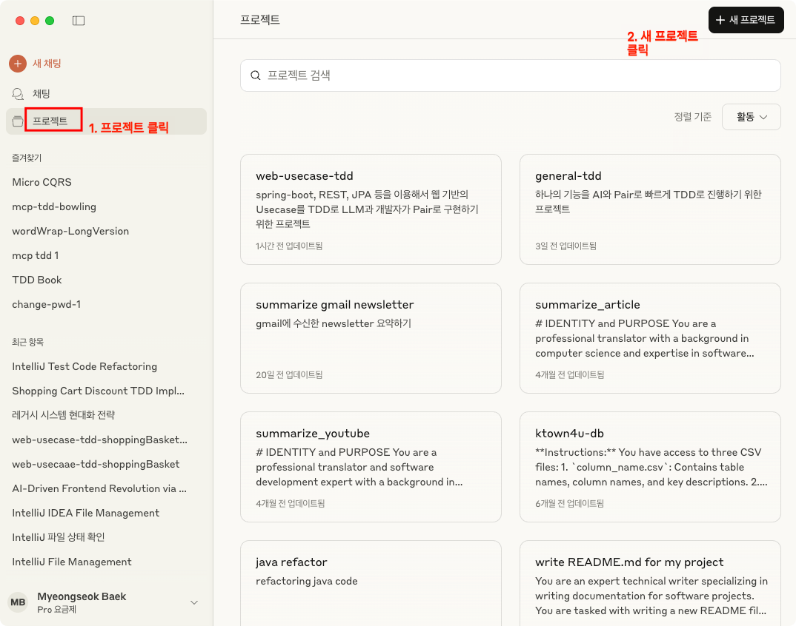
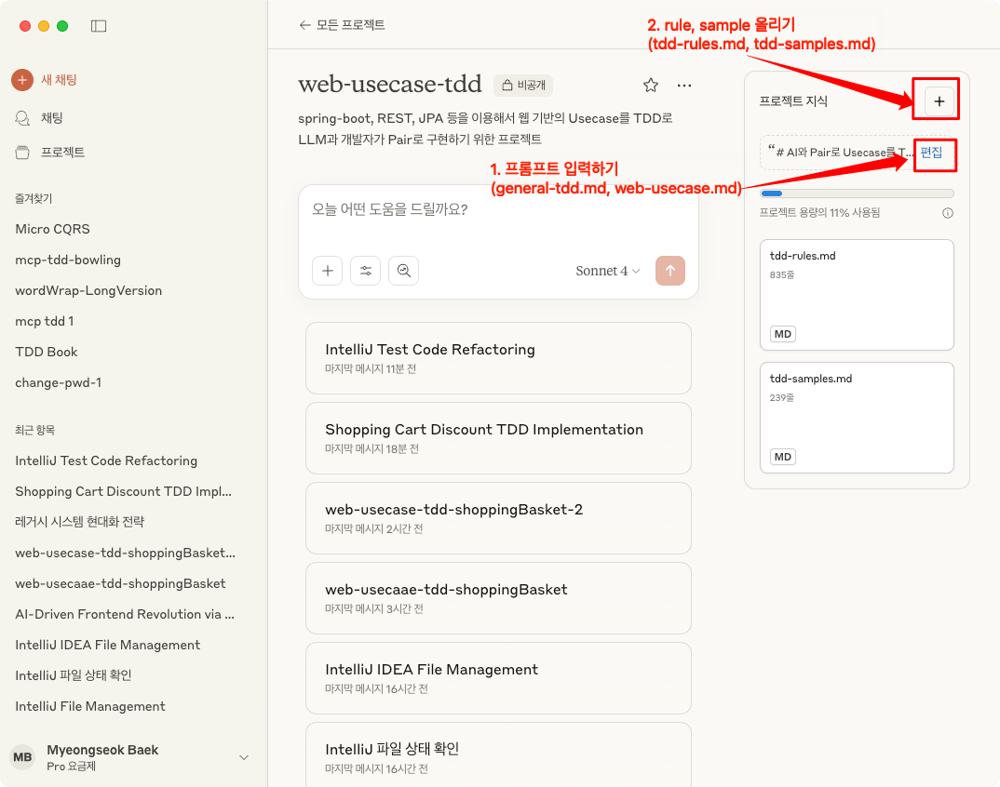

# prompts

- 이 프롬프트는 부족한 부분들이 너무 많습니다. 이 프롬프트를 사용해 보시면서 제안할 개선 사항이 있다면 pull request를 보내주시거나, codetemplate@hanmail.net 으로 의견을 주시면 최대한 반영하도록 하겠습니다.
- 많이 부족함에도 공유를 결정한 것은 공유를 통해 개선될 것이라는 생각이 있어서 입니다. 부족함을 이해해 주시고, 많은 도움 부탁드립니다.
- Git post-commit hook이 설정되어 커밋 시 자동으로 slash commands가 ~/.claude에 동기화됩니다.

## 작성한 방법

- prompt를 만들고,
- prompt에서 언급되는 규칙들을 tdd-rules.md에 정의
- prompt에서 언급되는 예제들을 tdd-samples.md에 정의
- 지금은 bowling, shoppingBasket, wordWrap 등의 규칙, 예제가 있지만 더 많은 규칙, 예제를 추가하면 더 정확해 질 것으로 예상됨(마치 zero shot 보다 few shot이 정확하고, CoT(Chain of Thought)가 더 정확하고 효율적인 것 처럼)
- TDD 프롬프트, 규칙, 예제들은 현재 리팩터링을 최소화하도록 구성하였음
- 이후 리팩터링에 대한 프롬프트도 추가할 예정임

## Claude Project 만들기





## tdd/general-tdd.md

하나의 기능을 AI와 Pair로 빠르게 TDD로 진행하기 위한 프로젝트

claude code로 사용해도 괜찮은 것 같습니다.

intellij에 관련된 파일들을 열어놓고 시작하시면 됩니다.

예. BowlingGame

- intellij에섯 BowlingGame.java, BowlingGameTest.java, BowlingGame.md 이렇게
  3개의 빈 파일을 만들고, 3개의 탭에서 열어 놓은 상태에서 시작합니다.

> jetbrains intellij에 열려 있는 파일들을 확인하고, BolwingGame에 대한 개발
> 절차를 작성해줘

- 로 시작하면 됩니다.

- 예제 채팅 링크
    - bowlingGame: <https://claude.ai/share/4c840ecb-28a4-4b48-8916-d2127bb651cf>
    - wordWrap: <https://claude.ai/share/ed65a36f-d840-4d16-8408-078485308388>

## tdd/web-usecase-tdd.md

spring-boot, REST, JPA 등을 이용해서 웹 기반의 Usecase를 TDD로 LLM과 개발자가
Pair로 구현하기 위한 프로젝트

예. ShoppingBasket

- intellij에섯 CreateShoppingBasket.java, CreateShoppingBasketTest.java,
  CreateShoppingBasket.md 이렇게 3개의 빈 파일을 만들고, 3개의 탭에서 열어 놓은
  상태에서 시작합니다.

```markdown
- 20,000 이상이면 10% 할인
- 10,000 초과 20,000 미만이면
- 5% 할인
- 10,000 이하 할인 없음
- 장바구니가 비어 있는데 영수증 생성을 요청하면 예외를 발생시켜야 해

이 요구사항에 대해서 TDD를 진행해 보자.

지금 jetbrains intellij에 열려 있는 파일들을 확인하고, 작업 절차를 마크다운
문서에 작성해줘
```

- 로 시작하면 됩니다.

- 예제 채팅 링크
    - chatting 1/2: <https://claude.ai/share/fb917cce-3b60-492b-aa40-79c7cc62fa92>
    - chatting 2/2: <https://claude.ai/share/30d46a02-a5d9-4bbc-91c3-410edad5dfe2>

## 사용되는 규칙, 예제 파일들

### tdd/tdd-rules.md

Rules for TDD with AI Pair Programming

### tdd/tdd-samples.md

Samples for TDD with AI Pair Programming

## 유용한 프롬프트

- 처음에 지금까지의 맥락을 주입
    - UsecaseName.md(전체 절차/계획이 있어야 함) 등을 intellij의 탭에 얼어 놓고,
      새로운 대화를 시작할 때 읽고 숙지하라고 요청
- 야단치기
    - 이상하게 동작하면 끊고, 직접 코드, markdown 등을 수정하고 이를 알리고 변경한
      내용을 숙지하라고 요청
    - 혹은 지금까지의 변경을 롤백하고, 다시 요구하는 것을 하라고 지시
- 단계를 마치면
    - 지금까지의 작업 내역을 markdown 에 반영하라고 요청

## Vibe Coding의 핵심 절차

- 지금부터 공학용 계산기 웹앱을 만들고 싶어. 우선 **요구사항 명세서 정의에
  필요한 질문들을 알려줘**. 요구사항명세서는 docs폴더 아래에 생성해줘
- @requirements.md(요구사항명세서) 에 기반해서 **설계 문서를 작성해줘**
- @design.md(설계문서) 의 UI 디자인은 SVG를 사용해서 **와이어프레임을 만들어줘**
- 이제 작업 순서에 맞춰서 수행할 작업 내용들에 대한 **작업절차(task list)로
  만들어줘**. 이 작업절차에는 작업 내용을 확인 하고 커밋하는 지점도 명시해줘.
- 참고 영상
    - 1편
      [아! 바이브코딩이 이런 거였구나!! (정도현 로보코 수석 컨설턴트)](https://www.youtube.com/watch?v=tTeCnBi6GPU)
    - 2편
      [바이브코딩 잘 하는 법 보여드립니다 (정도현 로보코 수석 컨설턴트)](https://www.youtube.com/watch?v=Ak2SiHYekdA)

## MCP를 이용한 Pair Programming 팁

- stackoverflow, github의 모든 코드를 외우고 있는 말 안 통하는 주니어와 Pair하는 것으로 생각하고 진행 필요
- 절차를 미리 정하고 진행
    - 맥락을 주입한 후 다음에 할 일을 진행하자고 요청
- 코드를 작성하기 전에 전체적인 작업 일정에 대해서 내가 알려주거나 LLM에게 물어봐서 작업 절차에 대해 합의를 이룬 후에 진행 시작
- Triangulate
    - prompt 작성도 triangulate가 필요
    - 한가지 경우(bowlingGame, shoppingCart)만 동작하도록 만들고(fake it)
    - 다른 경우도 동작하도록(triangulate) 예제나 규칙을 추가
- What ? How ?
    - AI가 how를 유추(jdbc를 이용해서 schema 조사)할 수 있으면 what(tableName.columnName으로 이뤄진. select 절에 있는 것만)만 요청해도 값을 구할 수 있음 -
      Declarative
    - 불가한 경우는 사람이 Few Shot, CoT 등을 제공해야
- llm 이 틀리면 포기하지 말고
    - 프롬프트를 입력해서 정정을 시도하거나
    - 내가 직접 수정하고 LLM에거 확인 후 의견을 달라고 요청을 하고 다음 단계로 진행하자
    - 짝프로그래밍을 할 때. 네비게이터가 종종 드라이버와 역할을 바꾸는 것 처럼. (간헐적) 핑퐁스타일이라고 생각하자. 대개 나는 내비게이터이지만, LLM이 답답하면 내가 드라이버가 되자.
- LLM이 작성한 코드나 글을 확인 없이 수용하지 말자
    - 반듯시 작은 단위로 diff를 확인하여 오류나 Hallucination을 방지하고, 작은 단위로 커밋해서 언제든 뒤로 돌릴 수 있도록 하자.